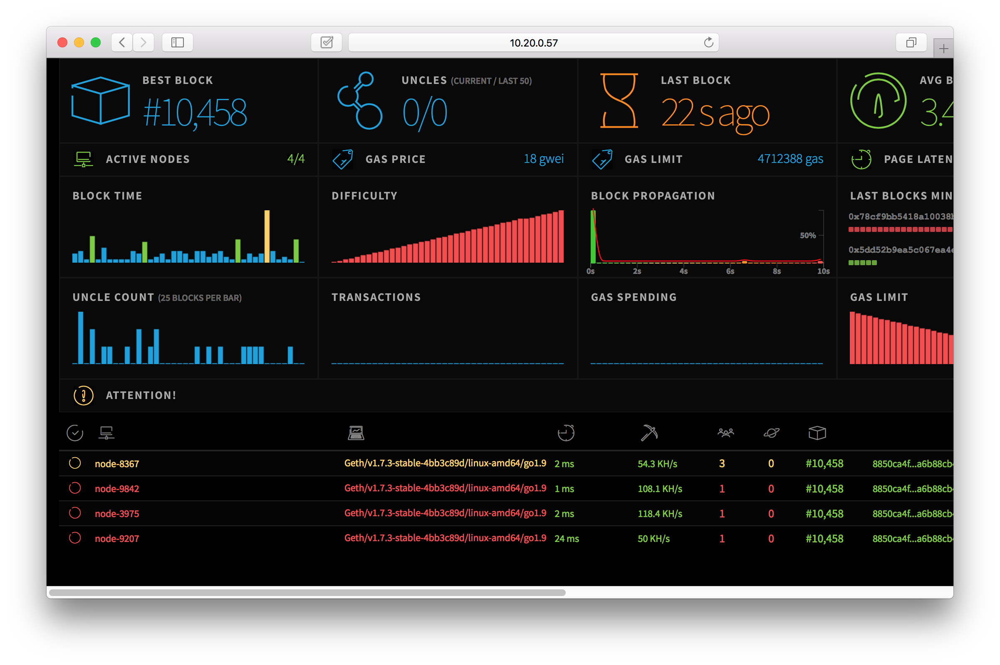

# Kubereum

> Kubereum = Ethereum + Kubernetes

This repos is based on Kubernetes to develop private Ethereum example. Automated deployment reduces developer time spent setting up the Ethereum environment.

## Features

* Build a private Ethereum environment.
* Using monitor component to monitor the overall cluster status.
* The system can restore block data and account when the pod crashes.
* Modify `REPLICAS` params in `start.js` to adjust the cluster size.
* Provide logs for developer to debug.
* Using NFS server (current only supported) to backup block data and accounts.
* Provide JSON RPC proxy for developers to call.
* Provider Ethereum dashboard (netstat).

## Requirements

* Current only supported `Ubuntu 16.04`
* Used for `Node >= 7.0.0`
* Docker engine
* Kubernetes cluster
* Kubernetes nodes need to install `nfs-common`

## Quick start

Copy `./build/start.example.js` to `./build/start.js` and configure parameters.

```
...
const STORAGE_SYS = 'NFS'  // current only supported
const STORAGE_IP = '10.20.0.10'  // NFS server IP address
const K8S_MASTER_IP = '10.20.0.11' // Kuberentes master IP address
const K8S_NODE_IP = ['10.20.0.12', '10.20.0.13', '10.20.0.14', '10.20.0.15'] // Kubernetes nodes IP address
const STORAGE_PATH = '/var/nfsshare' // NFS server shared directory
const REPLICAS = '4' // Ethereum miner node number
...
```

RUN `./build/start.js`

## Configuration

If your nodes of kubernetes not enough resource, you need to modify `build/kubernetes/node-dp.yaml`. By default we use 3 core and 2GB memory to run ethereum node Pod, but kubereum will have an error when your kubernetes not any one node enough resources.

```
kind: Deployment
apiVersion: extensions/v1beta1
metadata:
  name: node
  namespace: kubereum
  labels:
    app: node
spec:
  replicas: 2
  template:
    metadata:
      name: node
      labels:
        app: node
    spec:
      containers:
      - name: node
        image: cijie/kubereum-node:0.1.0
        env:
        - name: WS_SECRET
          value: '88888'
        ports:
          - name: rpc
            containerPort: 8545
          - name: enode
            containerPort: 2000
        volumeMounts:
        - mountPath: /eth-net-intelligence-api/kubereum/node/env
          name: nfs-volume
        resources:
          requests:
            memory: "2048Mi"
            cpu: "3"
          limits:
            memory: "2048Mi"
            cpu: "3"
...
```

## Dashboard


